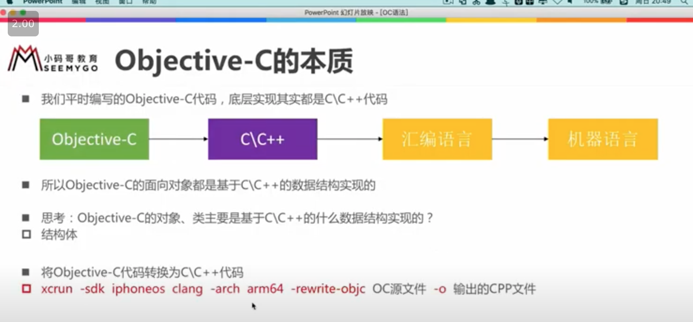
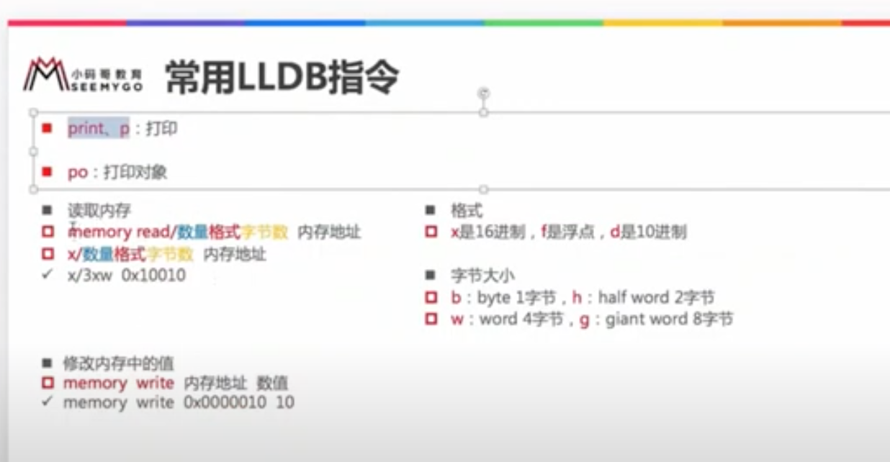
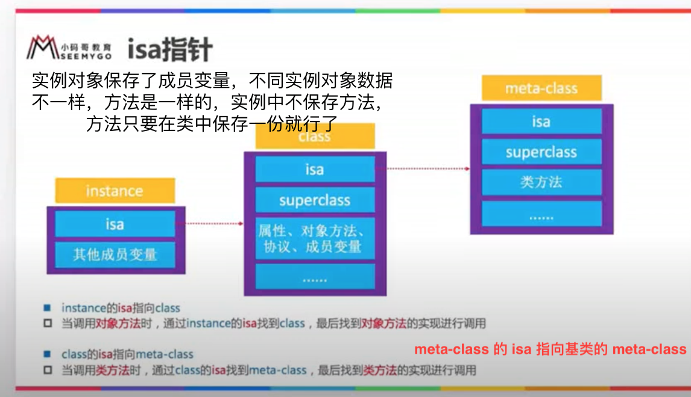
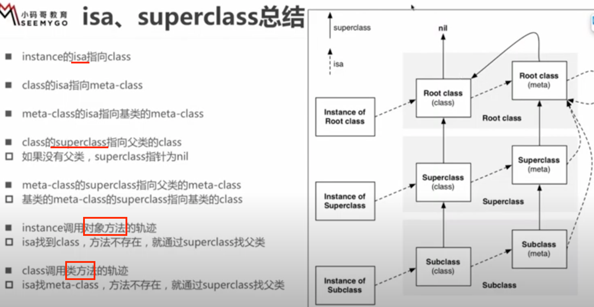
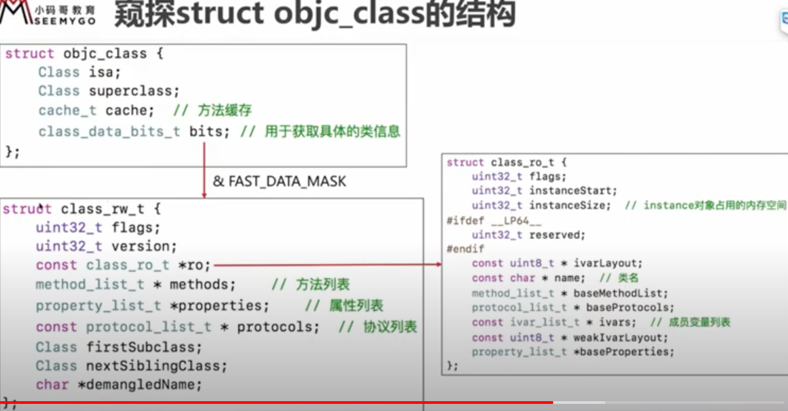
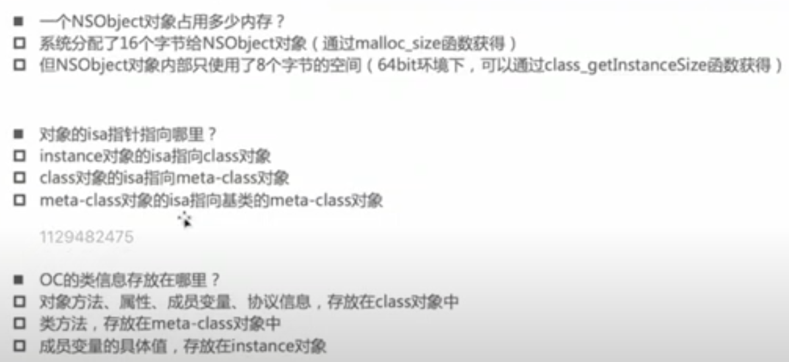

源码
https://opensource.apple.com/tarballs/objc4/


## 1、NSObject 占用内存  

NSObject *obj = [[NSObject alloc] init];  
obj 占用多少内存？ 系统分配16个字节，但对象内部只使用了8个字节(64bit环境下)  

OC 对象的本质  
OC 转换成 C++ 代码：  
> xcrun -sdk iphoneos clang -arch arm64 -rewrite-objc oc.m -o c.cpp  

-sdk iphoneos 转换为对应平台的代码，win mac iOS，  
-arch arm64 架构，模拟器(i386) 32bit(armv7) 64bit(arm64).   

  


```
struct NSObject_IMPL { Class isa; };  
//typedef struct objc_class *Class;  
//isa 是个指针，在64位系统里占 8个字节  

#import <objc/runtime.h>  
//class_getInstanceSize 获取类的实例对象的大小。至少需要多少内存空间。类似于 sizeof(struct) 运算符，不是函数，这是编译的时候就确定了大小。
//类实例对象的成员变量所占用的大小。
NSLog(@"%zu", class_getInstanceSize([NSObject class]));  == 8

#import <malloc/malloc.h>
//malloc_size 获取指针指向的内存大小。实际分配内存的大小。
NSLog(@"%zu", malloc_size((__bridge const void *)(obj)));  == 16
```

NSObject alloc 分配 16个字节，但是用到的就 8个字节 用来放 isa 指针。  
查看 runtime 源码，看到 class_getInstanceSize 最终调用 instanceSize() 方法 size<16 的话 size=16;  
获取对象大小，最小为16字节，系统框架就是这样设计的。不知为何 class_getInstanceSize == 8 ？  

查看内存数据：  
可以打断点 菜单中 debug -> debug workflow -> view memory 在 address 栏输入要查看的对象地址 0x100 就可看到对象的 data;  
也可以 lldb: memory read(简写 x) 0x108f68650 打印出对象内容，格式化输出 x/4xg(数量格式字节数)  
memory write 0x108f68650 1 修改地址对应的值，调试时可能会用到。  


  


带有成员函数的对象:  
```
@interface Student : NSObject {
    @public
    int _no;
    int _age;
}
@end

//实现类似于，下面的结构体  
//struct NSObject_IMPL { Class isa; }
//struct NSObject_IMPL NSObject_IVARS;
struct student_IMPL {
    Class isa; //8
    int _no; //4
    int _age; //4
};
//sizeof(struct student_IMPL) == 16

Student *obj = [[Student alloc] init];
obj->_no = -1; obj->_age = 3;
//调用函数 class_getInstanceSize=16 malloc_size=16
//如果再增加一个成员变量 int _heigt; class_getInstanceSize=24 malloc_size=32 , 方法 malloc_size 调用 calloc(size) 传进去的 size=24 但是系统分配内存优化了，为了方便存取，分配16的倍数内存。


struct student_IMPL *std = (__bridge struct student_IMPL *)obj;
NSLog(@"no = %d, age = %d", std->_no, std->_age); //-1 3
//说明对象底层转换为结构体

```

如果继承于NSObject的对象，添加了一个成员变量，int age; 那么改对象占 16个字节  
内存对齐：结构体的大小必须是最大成员大小的倍数，最大成员 isa 指针占 8个字节。这是计算结构体大小，内存对齐。  
操作系统分配内存时(实际上占内存大小)，也有内存对齐的概念，为了方便存取 速度快一点，分配16的倍数内存。  
可参考，gnu (gun not unix) 开源组织，查看开源代码 glibc 内存分配的处理。


对于对象里的属性声明：
@property (nonatomic, assign) int height;  系统会自动生成对应的成员变量 _height 以及 setter  getter 方法。

<br>  


## 2、OC 对象的分类  


* instance 对象（实例对象）每次调用 alloc 都会产生新的实例对象。存储的信息有 isa指针、其他成员变量。  
* class 对象（类对象）内存中存储的信息有 isa指针、superclass指针、类的属性信息 @property、类的对象方法信息 -(void)method;、类的协议信息、类的成员变量信息 类型描述等信息。  
* meta-class 对象（元类对象）存储的信息有 isa指针、superclass指针、类方法信息。和类对象内存结构是一样的，**都是 Class 类型**，只不过有的数据为空。  

```
        //instance 对象，实例对象
        NSObject *obj = [[NSObject alloc] init];
        
        //class对象，类对象
        Class cls1 = [obj class];
        Class cls2 = object_getClass(obj); //传入实例对象，返回类对象
        Class cls3 = [NSObject class];
        NSLog(@"%p %p %p", cls1, cls2, cls3);
        //0x7fff88b17cc8 0x7fff88b17cc8 0x7fff88b17cc8 
        //都是一样的,只有一个类对象
        
        //meta-class 对象，元类对象
        Class metaCls = object_getClass(cls1);
        NSLog(@"%p", metaCls); //0x7fff88b17ca0
        //元类对象也只有一个
        
        NSLog(@"%d %d", class_isMetaClass(cls1), class_isMetaClass(metaCls)); //0 1
        
```

Class objc_getClass(const char *aClassName);  
传入类名字符串，返回类对象。

Class object_getClass(id obj) { return obj->getIsa(); }
传入的值 obj = 
* instance对象，返回class对象。
* class对象，返回meta-class对象。
* meta-class对象，返回 NSObject(基类) 的meta-class对象。 

-class  +class  返回的就是类对象。


## 3、isa 指针  

  

如果 student 继承自 person，person 继承自 NSObject：  
当 student 的实例对象要调用 person 的 **对象方法** 时，会先通过 isa 找到 student 的 class，然后通过 superclass 找到 person 的 class 最后找到对象方法的实现进行调用。  
类似的，调用 person 的 **类方法** 时，通过 isa 去找自己的 meta-class，然后通过自己的 meta-class 的 superclass 找到父类的元类对象，就找到了类方法。  

类对象的 superclass 指针指向，父类的类对象。  
元类对象的 superclass 指针指向，父类的元类对象。  
基类(root class)的 meta-class 的 superclass 指向基类的 class。这个特殊。  

   


想查看 instance->isa 是否指向 class，lldb 打印:  
p/x (long)person->isa  
(long) $1 = 0x011d800100008189  

p/x (long)personClass  
(long) $2 = 0x0000000100008188  

发现打印地址不一样，系统做了处理，要和 define ISA_MASK  0x007ffffffffffff8ULL 与一下：  
p/x 0x007ffffffffffff8 & 0x011d800100008189  
(long) $3 = 0x001d800100008188  
类对象也是一样也要 & 一下，才等于 meta-class 地址。  

你也可以转换为结构体查看，第一位是 isa，第二位是 superClass:  
```
struct my_person_struct {
    Class isa;
    Class superclass;
};
struct my_person_struct *personClass = (__bridge struct my_person_struct *)([Person class]);  
```
参照源码看结构体有哪些成员变量，可用上面方法转换，查看对象的内容。  

  

  


