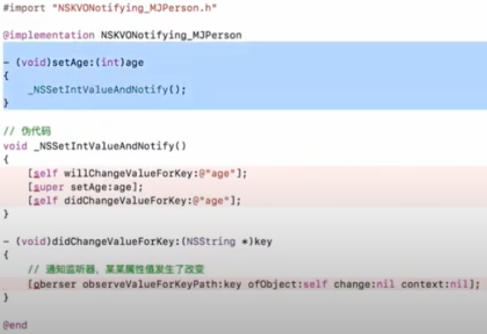

* iOS 用什么方式实现对一个对象的KVO？KVO的本质是什么？  
  利用 runtime api 动态生成一个子类，让 instance对象的 isa 指向这个新类。  
  当修改 instance 属性时，会调用 Foundation 的 \_NSSetxxValueAndNotify()   函数，触发监听器的监听方法 observeValueForKeyPath  

* 如何手动触发KVO？   
  [obj willChangeValueForKey:@"age"];  
  [obj didlChangeValueForKey:@"age"];  


## 1、KVO 内部流程  

添加 KVO 监听后，实例对象的 isa 会指向一个新生成的原类的子类 NSKVONotifying_Person 在对象的 setter 方法里会调用，\_NSSetxxValueAndNotify()   函数， 然后就可以监听通知，某属性发生了改变。  

  

新的类 NSKVONotifying_Person 还会重写 -(Class)class; 方法，让使用者通过 [obj class] 查看当前对象所属类的时候会返回其父类，使其看似没有改变什么，苹果屏蔽内部实现，隐藏新生成的类。可通过 object_getClass() 方法查看。   
所以调用 - (BOOL)isMemberOfClass:(Class)cls { return [self class] == cls; } 没有改变还是原类。  

    

下面图中可看到添加监听后 setter 方法不是原来的方法了：
  
可以通过 runtime 获取方法列表，派生类和原类方法列表的区别：  
```
Method *methodList = class_copyMethodList(cls, &count);
NSString *mname = NSStringFromSelector(method_getName(method));
//NSKVONotifying_Person --- setAge:, class, dealloc, _isKVOA
//Person --- setAge:, age
```

<br>
下面图中可看到，新生成的类对象的 isa 指针指向它自己的 NSKVONotifying_Person 原类对象。    
   

如果直接修改成员变量，self.person->\_age = 2; 这样不会调用 setter 方法，不会触发 KVO。  


## 2、KVC  

setValueForKey，会寻找 key 相关的  setter 方法，setKey:、\_setKey:  如果找不到调用 accessInstanceVariablesDirectly默认返回YES 能直接获取成员变量。  

  

如果没写属性，只有成员变量 \_key，通过KVC改变key也会触发KVO。  
KVC直接修改成员变量会调用 willChangeValueForKey: 从而会触发 KVO。  

通过KVC修改属性值，能否触发KVO？  
会触发KVO。


valueForKey 获取值过程：  
  


40，


