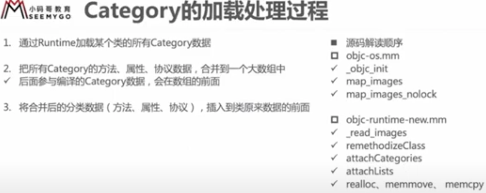
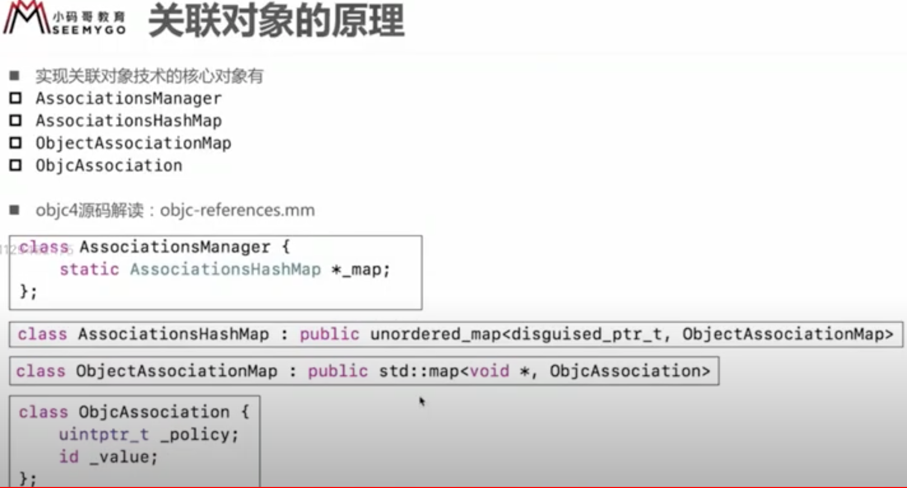
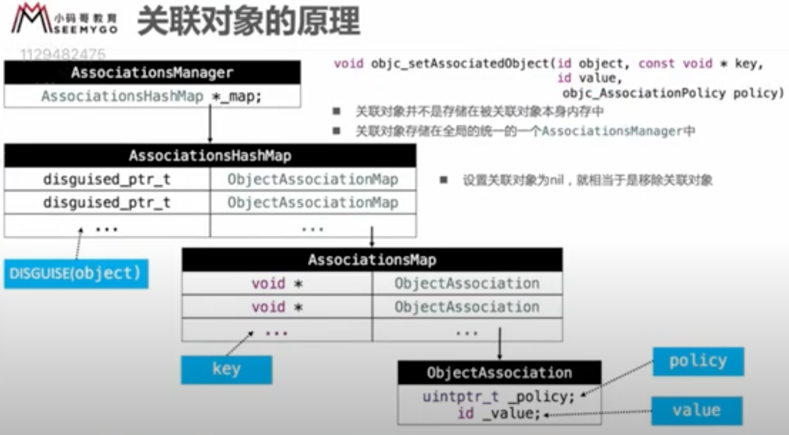
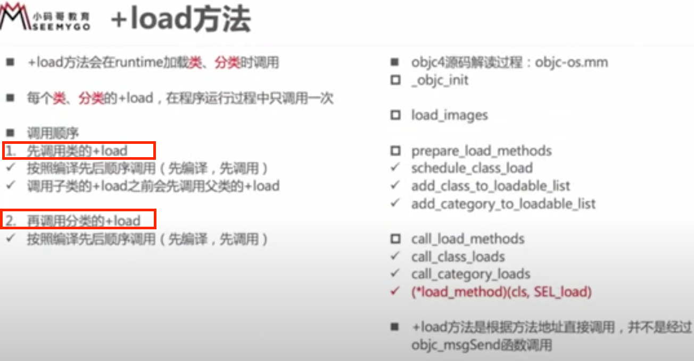
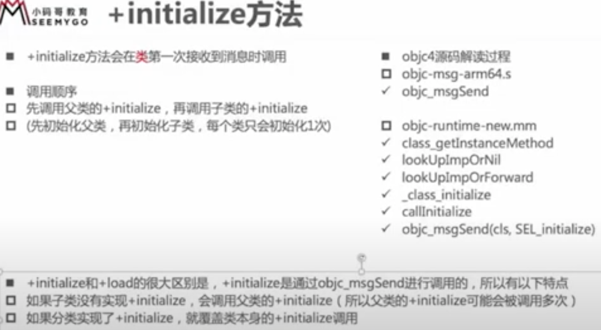

## category 加载过程  

category 编译之后底层结构是 struct category_t ，里面存储这分类的对象方法、类方法、属性、协议信息。  
程序运行时，都会通过 runtime 将 category 的数据合并到类对象、元类对象中去。  

  

extension 在编译的时候它的数据就已经包含在类信息中了。  
category 是在运行才将数据合并到类信息中。  


### category 能否添加成员变量？  
不能直接添加成员变量，但可以间接实现。  
在结构体 category_t 中有 property_list_t 放属性的列表，但是没有成员变量的表 ivars，看来可以在 category 中写属性 @property 但是没有生成对应的成员变量 \_var、getter、setter 方法。  
可以使用runtime关联属性：
```
//在分类中添加
@property (nonatomic, copy) NSString *name;

//自己实现 setter getter 方法
//static const void *NameKey = &NameKey; //值就是自己的地址。
//static声明只能本作用域使用，下面改进一下，直接使用地址作为key, &NameKey
static const char NameKey;
//或者直接在下面传入 @“name” 作为key，字符串常量，占用唯一的地址
//或者 @selector(name) 作为key，都可以。
//在getter方法里 _cmd == @selector(name), 所以在getter方法里可直接使用 _cmd 

- (void)setName:(NSString *)name {
    objc_setAssociatedObject(self, &NameKey, name, OBJC_ASSOCIATION_COPY_NONATOMIC);
}
- (NSString *)name {
    return objc_getAssociatedObject(self, &NameKey);
}

//移除 objc_removeAssociatedObjects(self);

```
关联对象添加成员变量，不是添加在类对象中，关联对象的原理：  
  
  


## load 调用  

load 方法的调用，和别的方法调用（消息发送）不一样（load 方法系统自动调用，在runtime加载类、分类时候调用），单独查找 load 方法直接调用，所以会先调用类中，然后再调用 category 中的 load 方法。不会存在 category 覆盖的情况。有继承的情况，总是先调用父类再调用子类。没有继承关系的各类，按编译顺序调用 load 方法。  

  


## initialize 调用  

会在类第一次接收到消息时调用。（[Person alloc] 发送了消息，这时会调initialize）  
[Student alloc]; ==> objc_msgSend([Student class], @selector(alloc));  

调用子类的 initialize 时会先调用父类的 initialize 方法（如果父类还没调用initialize的话会调用，若没调用过，子类调用initialize时会先调用父类的initialize）。  
```
if (自己没有初始化) {
	if (父类没有初始化) {
		objc_msgSend([Person class], @selector(alloc));
	}
	objc_msgSend([Student class], @selector(alloc));
}
```

如果子类没实现initialize，父类实现了initialize，子类第一次接收到消息后父类initialize会调用两次，虽然父类initialize调用两次，但父类只会初始化一次，第二次初始化算子类的。每个类只会初始化一次。    
（接上面解释：第一次父类没有初始化，父类调用一次initialize，第二次是现在子类中找initialize方法，没实现没找到，然后通过superClass去父类中找initialize方法，找到了调用）  

  


### load、 initialize方法的区别什么？  
1.调用方式  
* load 是根据函数地址直接调用  
* initialize 是通过 objc_msgSend 调用  
2.调用时刻  
* load是runtime加载类、分类的时候调用（只会调用1次）  
* initialize是类第一次接收到消息的时候调用，每一个类只会initialize一次（父类的initialize方法可能
会被调用多次）  

### load、 initialize的调用顺序？  
1. load  
* 先调用类的load  
a）先编译的类，优先调用load  
b）调用子类的load之前，会先调用父类的load  
* 再调用分类的load  
a）先编译的分类，优先调用load  
2. initialize  
* 先初始化父类  
* 在初始化子类（可能最终调用的是父类的initialize方法）  

51，

