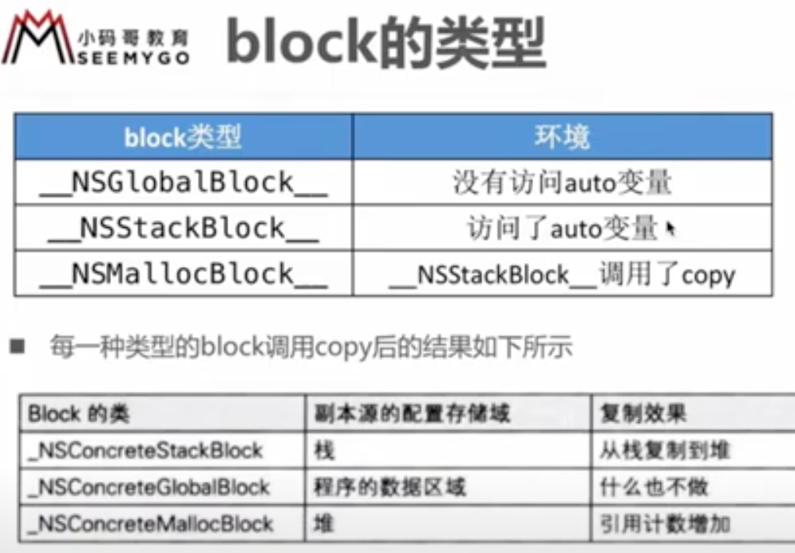

block的原理，本质是什么  
封装了函数调用以及调用环境的OC对象  
\_\_bokc的作用，使用注意事项  
block属性修饰为何是copy，使用block注意事项  
没有copy操作，就不会在堆上。注意循环引用问题。 
block在修改NSMutableArray，要不要加\_\_block  
只是修改，没有改变的话，不需要加。  

## block 的本质  

block 本质上也是个 OC 对象，内部也有 isa 指针  
block 是封装了函数调用以及函数调用环境的 OC 对象  

   

block  变量捕获机制，保证block内存能正常访问外部的变量：  
局部变量，auto 捕获 值传递方式，static 捕获  指针传递方式。  
全局变量  不会捕获  直接访问就行了。  

在类中定义一个block，在block里使用self，self会被block捕获，当做局部变量：  
void (^block)(void) = ^{ NSLog(@"%@", self); };  
block();  
类似的捕获对象的成员变量 \_name 也会捕获 self，相当于 self->\_name。  

## block 类型  

[[[block class] superclass] superclass] == NSObject  
有时候转换为C++的代码，显示的block类型，与真实运行的可能不一样。  

   

在使用 clang 转换 OC 为 C++ 代码时，OC 中使用 \_\_weak 可能会遇到问题:  
cannot create \_\_weak reference in file using manual reference.  
解决方法，支持 ARC、指定运行时系统版本：  
xcrun -sdk iphoneos clang -arch arm64 -rewrite-objc -fobjc-arc -fobjc-runtime=ios-8.0.0 main.m  

什么时候栈上的 Block 会复制到堆上：  
* 调用 Block 的 copy 实例方法时  
* Block 作为函数返回值返回时  
* 将 Block 赋值给有 \_\_strong 修饰符 id 类型的类或 Block类型变量时  
* 在方法名含有 usingBlock 的 Coca 框架方法 或 GCD 的 API 中传递 Block 时  

## __block  

   

\_\_block 变量的结构体成员变量 \_\_forwarding 可以实现无论 \_\_block 变量配置在栈上，还是堆上都能正确的访问 \_\_block 变量。  

## block 内存管理  

   
   

block 内部访问基本变量，访问对象的区别。  
访问对象时，转换后在结构体 desc 会多两个成员 copy  dispose 函数指针，用来对访问的对象进行内存管理。  

   

当使用 \_\_block int age = 0; 在 block 中修改 age，转换后会生成 \_\_Block\_byref\_age\_0 *age;  结构体(里面也有isa指针，类似于对象)，在 desc 结构体中，也会多两个成员 copy  dispose 函数指针，用来对  \_\_Block\_byref\_age\_0 *age; 对象进行内存管理。    

   

当使用 \_\_block 修饰对象时，与修饰基本数据类型对比，不同的是：  
\_\_block NSObject \*obj = [NSObject new]; 转换为 struct \_\_Block\_byref\_obj\_0; 在结构体里有 obj 指针，而且多了两个成员，\_\_Block\_byref\_id\_object\_copy  dispose  函数指针，用来处理 obj 的拷贝或释放，多了一层 copy 和 dispose 的处理，基本数据类型值传递，不用处理。  
注意 block\_impl\_0 里的成员 desc 结构体里的 copy 和 dispose 函数是对 \_\_Block\_byref\_obj\_0 \*forwarding; 这个整个对象进行 copy 或者释放的操作。而上面说的是对这个对象里的 obj 的 copy或释放的操作。  

   

循环引用问题  
\_\_weak 不会产生强引用，指向对象销毁时，会自动让指针置为nil  
\_\_unsafe\_unretained 不会产生强引用，不安全，指向的对象销毁时，指针存储的地址值不变。  

person.block = ^{ ...;  person = nil;  }; 这样必须执行block才能打破循环引用。  

69
78
89

