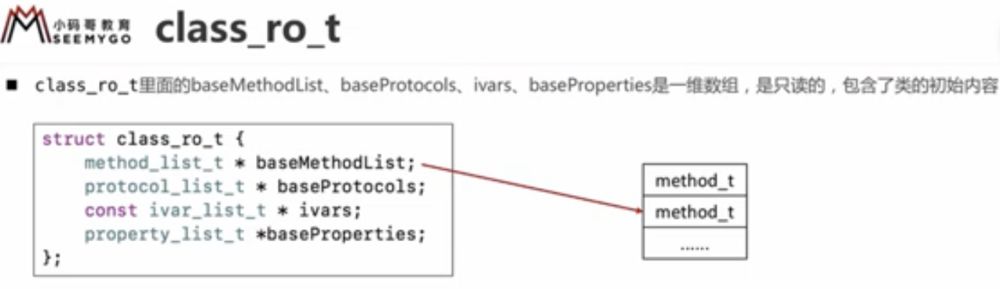

OC 消息机制  
消息转发机制  


OC 动态性比较强的编程语言。OC 动态性是由 runtime api 来支撑的。  
runtime api 提供的接口基本都是 C 语言的，源码由C C++ 汇编语言编写。  


## isa  

NSObject 有个成员变量 Class isa; 这个是什么，一步步的找：  
```
@interface NSObject <NSObject> {
    Class isa  OBJC_ISA_AVAILABILITY;
}

typedef struct objc_class *Class;
struct objc_class : objc_object {
    // Class ISA;
    Class superclass;
    cache_t cache;           // formerly cache pointer and vtable
    class_data_bits_t bits;  // class_rw_t * plus custom rr/alloc flags
    ...
}
//Class 就是结构体 objc_class，继承自 objc_object  

//结构体 objc_object 里面就一个成员变量 isa_t isa;
typedef struct objc_object *id;
struct objc_object {
private:
    isa_t isa;
}

//下面就来分析一下 isa_t  objc_class 的内容
//各个版本更新代码可能有改动，在不同平台上运行代码都不一样，模拟器 真机，只做参考

```

### 共用体 isa_t 详解  
isa_t 是共用体， 指针 cls 和 指针 uintptr_t  bits（相当于这俩就是同一个东西内容一样就是名字不一样），共用一块内存 64位。各个位表示内容如下图所示。  
   
   

其中的 shiftcls 占33位，这就是保存的类或元类对象的地址。  
这里它把信息都放在一起了uintptr_t  bits 64位里，取值的时候 &ISA_MASK 通过位运算计算你想要的值。例如计算 shiftcls 让 bits & 0..01..1000   前面28位0，中间33位1，后面3位0，这就得到了类或元类对象的内存地址，你打印所有的类或元类地址，后3为永远为0。  


### 结构体 objc_class 详解  
结构体的内容如下：  
   

其中的 class_ro_t 保存编译后的初始化信息 read only，运行后会把 class_ro_t 里的成员变量、方法、协议等信息，和运行时添加的（分类添加的方法等）一起合并到 class_rw_t 中，其中的 methods 是一个二维数组，方便后面的方法添加。  

   
   


#### 结构体 method_t  

   

types 是一种编码格式，将方法编码对应的格式。  
例如方法： -(void)test:(int)age height:(float)height; 编码为 i24@0:8i16f20  
每个方法系统处理的时候都会带上所属的类id self 和 SEL \_cmd 信息，上面的可解释为：  
i 返回值为 int 类型，一共24个字节，@ id类型从0字节开始 id保存的地址占8字节，: SEL 从8字节开始 占8字节，i 参数age int 类型从16位开始 占4字节，f 参数 height float 类型从20位开始 占4字节，一共占24个字节。  
可以打印，看不同的符号代表那种类型，NSLog(@"%s", @encode(SEL)); //id = @  SEL=:  int=i float=f  void=v char *=*   


可以代码手动转换一下看看：  
```
struct method_t {
    SEL sel;
    char *types;
    IMP imp;
};  

struct method_t *method = (struct method_t *)class_getInstanceMethod(self, @selector(other));
NSLog(@"%s %s %p", method->sel, method->types, method->imp);
//other v16@0:8 0x100003d80
//p (IMP)0x100003d80  ==> (IMP) $0 = 0x0000000100003d80 (NSObject-test`-[Person other] at main.m:29)

//po method->sel   ==> "other"
//p method->types  ==> (char *) $3 = 0x0000000100003fa2 "v16@0:8"
//po method->imp   ==> (NSObject-test`-[Person other] at main.m:29)

```


#### 方法缓存 cache_t  
每次调用方法时，都先去缓存中去找，找到了调用速度快，没找到去类对象方法列表中去找，第一次调用，会把方法放到缓存中去，方便下次调用。  
   

方法缓存是用散列表来处理的。散列表的处理过程：  

散列表中用数组来保存方法，首先通过方法的 SEL 来计算（哈希函数）出数组的索引，拿到索引去数组中取值，与 SEL 对比，是的就是找到了，不是苹果的处理方法是索引-1 去找，直到找到对应的方法，或者遍历一遍都没找到。缓存方法时，也是先计算索引值，看对应的索引是否存的有值，有值说明散列冲突了，索引值-1，找到有空位的保存进去。   

这里的计算索引值的方法是 sel & mask，mask 的值是散列表长度-1，位运算后得到的索引值不会大于 mask 的值，保证了数组不会越界。哈希函数处理方式都不一样，这里只是看到苹果的处理方法，也可以用求余 % 的方法，都可以。  

如果散列表存满了，会进行扩容处理，苹果的处理办法是，把散列表长度X2，然后清空散列表，因为 mask 变了，计算的索引值也变了，清空重来。  


## msgSend  

objc_msgSend 如果找不到合适的方法进行调用，会报错 unrecognized selector sent to instance 

   
   

objc_msgSend 的实现，看了源码用汇编写的，这个方法调用频繁，汇编更快一些吧。  

下面是有关调用流程：  
大致的流程，先查看方法的接受者是否为空，然后从接受者的类对象的 cache 中找，没找到去类对象的 class_rw_t 方法列表中找，没找到去父类对象中找，在父类对象中也是先从父类对象的 cache 中去找，若在父类对象中找到了，会缓存到子类对象 cache 中，也会缓存到父类对象的 cache 中。  
   

上面流程没找到的话，就看有没有动态添加该方法，注意实例方法、和类方法区别，实例方法添加到类对象中，类方法添加到元类对象中。添加后会标记着进行过了动态方法解析，然后重新走上面的消息发送流程。  
   

```
void c_other(id self, SEL _cmd) {
    NSLog(@"c_other - %@ %@", self, NSStringFromSelector(_cmd));
}
- (void)other { NSLog(@"%s", __func__);}

+ (BOOL)resolveInstanceMethod:(SEL)sel {
    if (sel == @selector(test)) {
        //动态添加方法
        /*
         Method method = class_getInstanceMethod(self, @selector(other));
        class_addMethod(self, sel,
                        method_getImplementation(method),
                        method_getTypeEncoding(method));
        */
        
        //添加c函数, c函数名就相当于函数指针
        class_addMethod(self, sel, (IMP)c_other, "v16@0:8");
        //c_other - <Person: 0x105806150> test
        
        return YES; //返回YES代表有动态添加方法
    }
    return [super resolveInstanceMethod:sel];
}

+ (BOOL)resolveClassMethod:(SEL)sel {
    if (sel == @selector(test)) {
        //添加c函数。注意传进去的是元类对象object_getClass(self)，类方法要添加到元类对象上
        class_addMethod(object_getClass(self), sel, (IMP)c_other, "v16@0:8");
        //c_other - Person test
        return YES;
    }
    return [super resolveClassMethod:sel];
}
```


