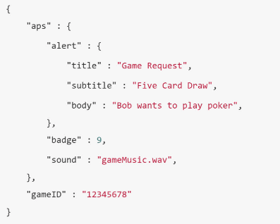
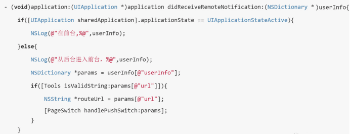

UserNotification 框架是针对远程和本地消息通知的框架，流程：  
注册、创建、推送、响应  

远程推送 APNS Apple Push Notification Service  
1、APP 向 iOS 系统申请远程消息推送权限。与本地消息推送的注册通知是一样的。  
2、iOS 系统向 APNs 服务器请求手机端的 deviceToken，并告诉 APP 允许接受推送的通知。  
3、APP 接收到手机端的 deviceToken。  
4、APP 将收到的 deviceToken 传给 APP 对应的服务器端。  
5、远程消息由 APP 对应的服务器产生，会先经过 APNs 服务器。  
6、APNs 服务器将远程通知推送给响应的手机。  
7、根据对应的 deviceToken 通知会推送到指定的手机。  

通过UIApplication的registerForRemoteNotifications方法向苹果的APNS服务器请求deviceToken，如果请求成功则didRegisterForRemoteNotificationsWithDeviceToken回调方法会被执行，为了便于业务服务器的调用，我们一般会将二进制的deviceToken转换为16进制的字符串后再进行存储；如果请求失败则didFailToRegisterForRemoteNotificationsWithError方法也会被调用，并附带具体的错误信息。  

远程推送注意事项：  
1、deviceToken，它是由APNs服务分配的用于唯一标识不同设备上的不同App，可以认为是由deviceID、bundleId和安装时的相关信息生成的，App的升级操作deviceToken不变，卸载重装App、恢复和重装操作系统后的deviceToken会发生变化。  
2、一个设备可能登录过多个用户，一个用户也可能在多个设备中登录过，当我们需要给不同用户推送不同的消息时，除了deviceToken之外，我们还需要保存用户的openid与deviceToken的映射关系。我们可以在用户登录成功后的时机更新openid和deviceToken的映射关系，用户退出后取消映射关系，只保存用户最后登录设备的deviceToken，避免一个设备收到多个重复通知和一个用户在不同设备收到多个通知等情况。  
3、APNs服务向用户设备推送消息这一步也是异步的，在用户关机或网络异常收不到推送的情况下，APNs会为每个deviceToken保留最后一条推送消息，待网络恢复后再次推送。  

后端调用流程：  
业务方服务器调用APNs服务时首先要建立安全连接，进行开发者身份的认证，分为基于证书（Certificate-Based）和基于Token（Token-Based）的认证两种方式，比较常用的是基于证书的认证方式。推送证书分为开发环境和生产环境的证书，分别对应不同的APNs推送接口，我们从苹果开发者平台或者第三方平台导出的推送证书一般有p12和pem两种格式的文件，为了便于接口调用我们可以通过命令将p12格式的文件转换为pem证书。  
1、业务方服务器（Provider）向APNs服务器发起建立TLS连接的请求。  
2、APNs服务器返回的它的证书，供业务方服务器校验。  
3、业务方服务器提供自己的推送证书，供APNs服务器校验。  
4、APNs服务器验证业务方服务器提供的推送证书无误后，TLS连接就已经建立完成，之后业务方服务器就可以直接向APNs发送消息推送请求了。  

app 服务器通过证书与APNs建立安全连接后可以进行连续多次的消息推送操作，每次消息推送都要指定deviceToken和Payload参数。Payload是一个json对象，用于配置iOS在收到远程消息推送时的展现形式，aps参数包含了苹果预设的alert、sound、badge等参数，其中alert参数可以是字符串，或者包含title、body等参数的字典类型；badge参数使用整形设置App图标右上角显示的数字，badge设置为0时角标不会显示；sound参数用于设置推送的声音，不传该参数或者传递空字符串则推送不会发出提示音，设置为default时使用系统默认提示音，也可以设置为具体的音频文件名，需要提前音频文件放到项目的bundle目录，且时长不能超过30s。  

  

APP 收到消息后处理：  
1、App正在前台运行，此时用户正在使用App，收到推送消息时默认不会弹出消息提示框，willPresentNotification回调方法会被调用，开发者可以从UNNotification对象中获取该推送消息的payload内容，进而获取自定义参数，然后显示一个自定义弹窗提示用户收到了新的消息；也可以在willPresentNotification方法中通过completionHandler函数的调用让推送消息直接在前台显示，用户点击前台显示的推送消息时，didReceiveNotificationResponse回调方法也会被执行。  
2.App在后台运行，此时用户点击推送消息会将App从后台唤醒，didReceiveNotificationResponse回调方法会被执行，开发者可以在该方法中获得payload，解析自定义参数并自动打开对应的页面。  
3.App尚未启动，此时用户点击推送消息会打开App，开发者可以从launchOptions中获取本地或远程推送消息中的自定义参数，待页面初始化完成后进行相关页面的跳转。  

  

收不到推送问题：  
让后台提供一些验证的接口。如果在SDK的管理后台可以推送到，调接口推不到。可以检查服务在调用第三方接口时是否成功，或者第三方调用APNs是否成功。这个一般可以在接口的响应中可以看到，在一些管理后台也可以看到历史记录。  
如果接口都调用成功了，还是收不到。一般是手机上的权限没有打开、有没有联网。或者payload中alert、sound等有没有正确的设置。  

推送延迟问题：  
首先推送延迟是客观存在的。无论是调用第三方接口，还是调用APNs都会有高峰期，都会有拥堵需要排队的情况。  
我们可以监控一下发生延迟情况时，调用第三方接口，或者调用APNs多久才返回。如果返回的都很及时，那么就是APNs处理不过来，或者跟设备协商有所问题。  

